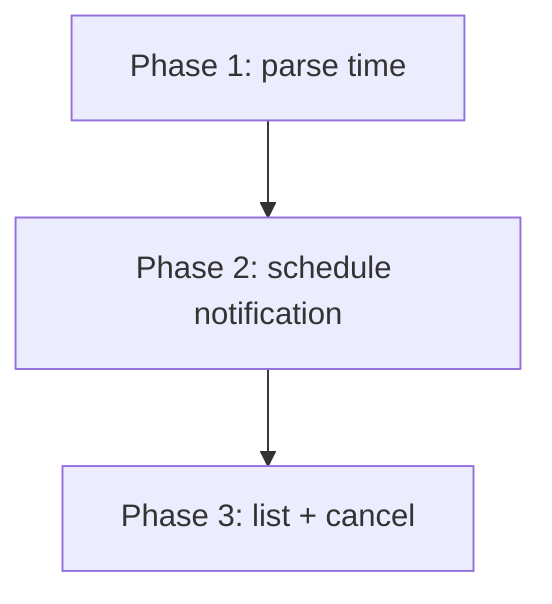
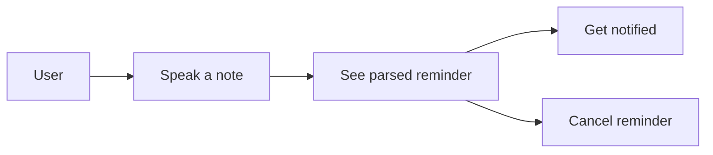

# Sample Feature — Voice Note Reminders

## Problem
Users capture voice notes but forget to act on them. We want time-based reminders
extracted from the note's content.

## Goals
- Detect date/time intents in a transcribed note.
- Schedule a local notification.

## Non-goals
- Recurring reminders.
- Calendar sync.

## User stories
- As a user, I speak "remind me tomorrow at 9" and get a notification then.
- As a user, I can see and cancel pending reminders.

## Definition of Done
- [ ] Date/time parser extracts an absolute timestamp from free text.
- [ ] A notification fires at the parsed time.
- [ ] Pending reminders are listable and cancellable.
- [ ] Edge case: ambiguous time asks for clarification (e.g. `</script>` in a note doesn't break parsing).

## Diagrams

### Phase / vertical-slice graph

### User-story map

